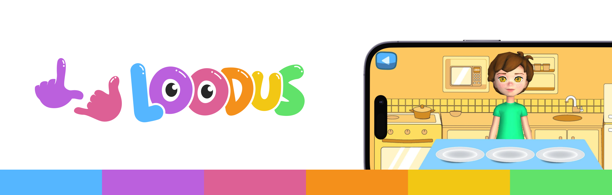

 

## 👋 Sobre o Projeto

O Loodus busca auxiliar no **processo de aquisição de linguagem de sinais** de crianças surdas com pais ouvintes, oferecendo às crianças um ambiente lúdico e interativo.

Este projeto é uma iniciativa desenvolvida pela [Universidade Federal de Alagoas](https://ufal.br/) (UFAL) com pesquisadores do [Instituto de Computação](https://ic.ufal.br/pt-br) (IC/UFAL) e da [Faculdade de Letras](https://fale.ufal.br/) (FALE/UFAL).

Nosso objetivo é construir um aplicativo móvel voltado para crianças surdas para apoiar o processo de aquisição da Libras (Língua Brasileira de Sinais) de forma lúdica e interativa.

Para isso, oferecemos um universo lúdico com minijogos e diálogos exclusivamente em Libras, inseridos no contexto da vida cotidiana da criança.

#### 🧭 Disponível em breve para dispositivos móveis Android e iOS
